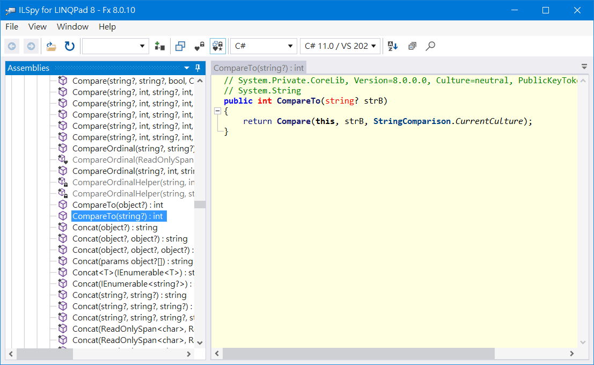

# 在 C# LINQ 如何進行字串大小的比較

## 前言
最近程式開發,  需要在 C# LINQ 針對某個欄位作字串大小比較, 原本以為用如下的寫法就能過, 但發現會有 "CS0019 Operator '>=' cannot be applied to operands of type 'string' and 'string'" 的錯誤.  
```csharp
var query = dataContext.VWEmpCities.Where(x => x.CityId >= "5");
```
後來問了 <a href="https://felo.ai/search" target="_blank">Felo Search</a>, 有提到了採用 **String.Compare** 或 **String.CompareTo** 進行字串大小的比較.  

以下就舉一個例子, 進行演練, 加深印象.  

## 環境

由於只是單純測一下, 就不再採用 Visual Studio 2022 或 Visual Studio Code 建立 Console 專案, 而是採用 LINQPad 8 進行演練.  

1. 工具: LINQPad 8 v8.7.4 
2. 資料庫: MS SQL 2016 Developer Edition

## 資料庫準備

主要是 2 個 Table: Employees, Cities 及 1 個 View: VWEmpCities.  

```sql
USE [Cookies]
GO

-- ===============
-- 刪除 View
-- ===============
DROP VIEW IF EXISTS [dbo].[VWEmpCities];
GO

-- ===============
-- 刪除 Table
-- ===============
DROP TABLE IF EXISTS [dbo].[Employees];
GO

DROP TABLE IF EXISTS [dbo].[Cities];
GO

-- ===============
-- 建立 Table
-- ===============
CREATE TABLE [dbo].[Cities](
	[CityId] [char](1) NOT NULL,
	[CityName] [nvarchar](50) NULL,
	CONSTRAINT [PK_Cities] PRIMARY KEY CLUSTERED ( [CityId] ) 
) ON [PRIMARY]
GO

CREATE TABLE [dbo].[Employees](
	[EmployeeId] [varchar](3) NOT NULL,
	[EmployeeName] [nvarchar](50) NULL,
	[CityId] [char](1) NOT NULL,
	CONSTRAINT [PK_Employees] PRIMARY KEY CLUSTERED ( [EmployeeId] ),
	CONSTRAINT [FK_Employees_Cities] FOREIGN KEY( [CityId] ) REFERENCES [dbo].[Cities] ([CityId])
) ON [PRIMARY]
GO

-- ===============
-- 建立 View
-- ===============
CREATE VIEW [dbo].[VWEmpCities]
AS
	SELECT Emp.EmployeeId
		, Emp.EmployeeName
		, Emp.CityId
		, City.CityName
	FROM [dbo].[Employees] Emp
	LEFT JOIN [dbo].[Cities] City ON ( Emp.CityId = City.CityId )
GO

-- ===============
-- 新增資料: Cities
-- ===============
INSERT [dbo].[Cities] ([CityId], [CityName]) VALUES (N'1', N'台北市')
GO
INSERT [dbo].[Cities] ([CityId], [CityName]) VALUES (N'2', N'新北市')
GO
INSERT [dbo].[Cities] ([CityId], [CityName]) VALUES (N'3', N'桃園市')
GO
INSERT [dbo].[Cities] ([CityId], [CityName]) VALUES (N'4', N'台中市')
GO
INSERT [dbo].[Cities] ([CityId], [CityName]) VALUES (N'5', N'台南市')
GO
INSERT [dbo].[Cities] ([CityId], [CityName]) VALUES (N'6', N'高雄市')
GO

-- ===============
-- 新增資料: Employees
-- ===============
INSERT [dbo].[Employees] ([EmployeeId], [EmployeeName], [CityId]) VALUES (N'001', N'jasper', N'1')
GO
INSERT [dbo].[Employees] ([EmployeeId], [EmployeeName], [CityId]) VALUES (N'002', N'judy', N'5')
GO
INSERT [dbo].[Employees] ([EmployeeId], [EmployeeName], [CityId]) VALUES (N'003', N'jack', N'3')
GO
INSERT [dbo].[Employees] ([EmployeeId], [EmployeeName], [CityId]) VALUES (N'004', N'jackie', N'2')
GO
INSERT [dbo].[Employees] ([EmployeeId], [EmployeeName], [CityId]) VALUES (N'005', N'joe', N'6')
GO
INSERT [dbo].[Employees] ([EmployeeId], [EmployeeName], [CityId]) VALUES (N'006', N'james', N'4')
GO
INSERT [dbo].[Employees] ([EmployeeId], [EmployeeName], [CityId]) VALUES (N'007', N'jane', N'1')
GO
INSERT [dbo].[Employees] ([EmployeeId], [EmployeeName], [CityId]) VALUES (N'008', N'jackson', N'1')
GO
INSERT [dbo].[Employees] ([EmployeeId], [EmployeeName], [CityId]) VALUES (N'009', N'john', N'5')
GO
INSERT [dbo].[Employees] ([EmployeeId], [EmployeeName], [CityId]) VALUES (N'010', N'mary', N'6')
GO
```

## 範例需求

想要取得在台南及高雄, 且姓名以 'j' 開頭的員工.  

## 演練1: 使用 LINQ to SQL 連接至資料庫, 取得 "篩選後" 資料

1. 建立 LINQ to SQL 的連線  
  

2. 撰寫程式碼 (Part 1)  
先重現問題, 再以最簡單的查詢作實驗: 只含 CityId 的過濾條件, 且條件為**常數**.  
值得留意的是: **LINQ to SQL 會把 LINQ 語法, 轉為 SQL 查詢**.  

```csharp
private void TestByDb1()
{
	var db = this;

	// CASE 1: 不能這樣寫, 會出現 CS0019 Operator '>=' cannot be applied to operands of type 'string' and 'string'
	// var query = dataContext.VWEmpCities.Where(x => x.CityId >= "5");

	// CASE 2: 字串的比對, 要改用 CompareTo 的方式處理; 會轉成如下的 SQL.
	// -- Region Parameters
	// DECLARE @p0 VarChar(1000) = '5'
	// -- EndRegion
	// SELECT[t0].[EmployeeId], [t0].[EmployeeName], [t0].[CityId], [t0].[CityName]
	// FROM[VWEmpCities] AS[t0]
	// WHERE [t0].[CityId] >= @p0
	var query = db.VWEmpCities.Where(x => x.CityId.CompareTo("5") >= 0);
	var result = query.ToList();
	result.Dump("TestByDb1");
}
```

3. 撰寫程式碼 (Part 2)  
含 CityId 及 EmployeeName 的過濾條件, 且條件為**變數**.  
```csharp
private void TestByDb3()
{
	var db = this;

	var userInput = "5";
	var nameStart = "j";
	var query = db.VWEmpCities.Where(x => x.CityId.CompareTo(userInput) >= 0 && x.EmployeeName.StartsWith(nameStart));
	var result = query.ToList();
	result.Dump("TestByDb3");
}
```

4. String.CompareTo() 其實是 String 的一個擴充方法.  
在 LINQPad 選取 CompareTo, 按 [F12], 會叫用 ILSpy 作反組譯.  



## 演練2: 使用 LINQ to SQL 連接至資料庫, 取得 "全部" 資料, 再作篩選

1. 撰寫程式碼
這裡就直接撰寫程式碼, 含 CityId 及 EmployeeName 的過濾條件, 且條件為**變數**.  
```csharp
public class VWEmpCityModel
{
	public string EmployeeId { get; set; }
	public string EmployeeName { get; set; }
	public string CityId { get; set; }
	public string CityName { get; set; }
}

private void TestByList3()
{
	var db = this;
	var allQuery = db.VWEmpCities;
	var allData = allQuery.Select(emp => new VWEmpCityModel
	{
		EmployeeId = emp.EmployeeId,
		EmployeeName = emp.EmployeeName,
		CityId = emp.CityId,
		CityName = emp.CityName
	}).ToList();

	var userInput = "5";
	var nameStart = "j";
	var query = allData.Where(x => x.CityId.CompareTo(userInput) >= 0 && x.EmployeeName.StartsWith(nameStart) );
	var result = query.ToList();
	result.Dump("TestByList3");
}
```

2. 實務需求
採用直接由資料庫過濾的方式為佳, 取回比較少的資料列.  
但有時會需要把原始資料作比較複雜的處理時, 只能在 C# 作過濾; 因此也一併作了測試.  

## 參考文件

* <a href="https://learn.microsoft.com/en-us/dotnet/api/system.string.compare?view=net-8.0" target="_blank">(Microsoft Learn) String.Compare method</a>  

* <a href="https://learn.microsoft.com/en-us/dotnet/api/system.string.compareto?view=net-8.0" target="_blank">(Microsoft Learn) String.CompareTo method</a>  


